+++
date = '2026-05-05T16:09:41+03:00'
draft = false
title = 'Paradise Ransomware'
+++
# Executive summary
The analyzed sample named "paradise.exe" is a 32-bit windows excutable that encrypts everything on the host.The sample establish presistence via windows startup folder and disable windows defender by editing registry.

# File Identification
* **Filename :** paradise.exe  
* **File Size :** 334 KB  
* **Architecture :** PE32 (x86)  
* **Compiler Stamp :** 2019-12-08 19:42:38  
* **MD5 :** 9ac8c2482e25dab49befb711172924f7  
* **SHA-256 :** c12b75f4b1bfcf41c45666f9a3801b735653c7ea61d14c3b700e60c035f55b32  
* **SHA-1 :** dbc38594cd2e6ab7ae0f2ab7dfdb023d73e6c1c9
* **BASE :** 0x0400000

# Static Analysis
### PE & Sections
The sample has 5 sections  
|Section|Size|
|-------|----|
|.text  |15000|
|.data  |2000 |
|.rsrc  |8000 |
|.py    |10000|
|.py    |15000|  

### Imports & Strings
All imports are destroyed, No interesting strings either so it idicactes the malware is packed.

# Dynamic Analysis
When running the malware it asks for administration access,if we gave it the access it encrypts every thing in our pc and rename them and adds .tor as extenstion.  
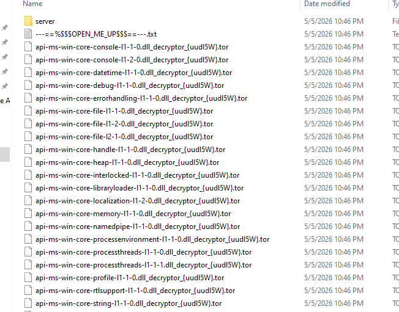
The malware makes a file called 
"---==%$$$OPEN_ME_UP$$$==---.txt" in every folder.  
if we opened "---==%$$$OPEN_ME_UP$$$==---.txt" it opens multiple windows of notepad and all displaying the same text    

"WHAT HAPPENED!
Your important files produced on this computer have been encrypted due a security problem.
If you want to restore then write to the online chat.
 
 
Contact!
Online chat: http://prt-recovery.support/chat/25-decryptor
Your operator: decryptor
Your personal ID: uudl5W
 
Enter your ID and e-mail in the chat that you would immediately answered.
 
 
Attention!
Do not rename encrypted files.
Do not try to decrypt your data using third party software, it may cause permanent data loss.
Do not attempt to use the antivirus or uninstall the program.
This will lead to your data loss and unrecoverable.
Decoders of other users is not suitable to decrypt your files - encryption key is unique."  

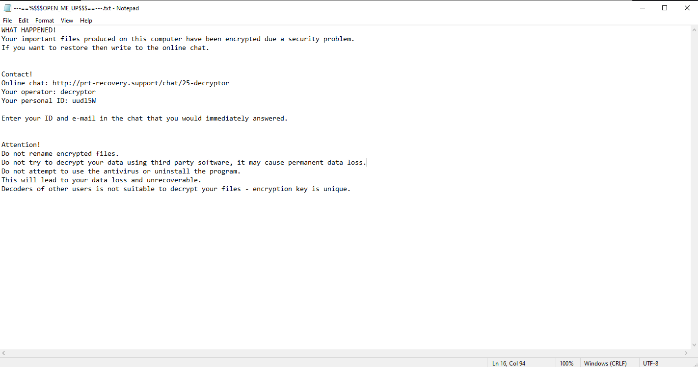  
the personal ID changes everytime you run the malware.  
The malware drops a file in the startup path "C:\Users\Malware\AppData\Roaming\Microsoft\Windows\Start Menu\Programs\Startup" it has a random name in my case it's "qkHQv9K52orENSR8a2q.exe" with the same size probably a copy of the malware.  
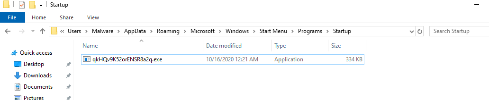
The malware delete itself from the host and relies on the copy in the startup folder,everytime we reboot the host the copy asks for administration access.

# Reverse Engineering & Code Analysis
When we open the code in ida we find nothing much as the malware is packed,there is a tale jump at the end of the start function at address **0x04040CC**
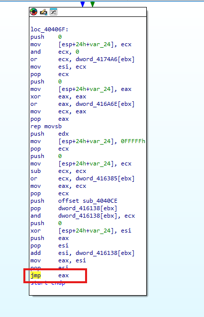
After we debug in x32dbg we find that the malware allocates memory in a remote location and copies the subroutine at address 0x04040CE
to that remote location as a secound stage unpacker.  
This subroutine rewrite the .txt in the original malware sample and that's the real code.
after rewriting the the .text the code jumps to the sample again at address 0x04031E0
when we hit address 0x04031E0 the first subroutine call is loading libraries and storing apis in memory
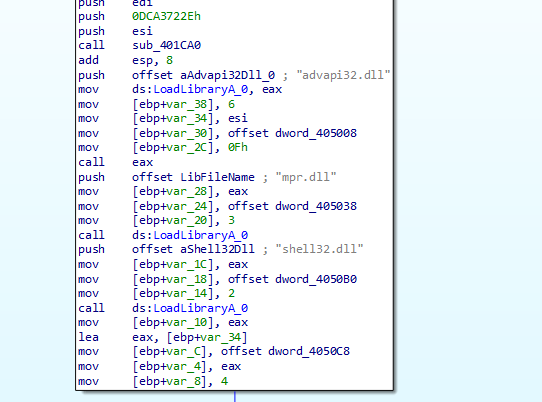
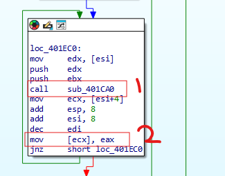
* **1-** is for getting the apis  
* **2-** is for storing it in memory

then the malware calls a subroutine sub_401C10 it loads resource from memory turns out this resource is the public key of RSA 2048-bit
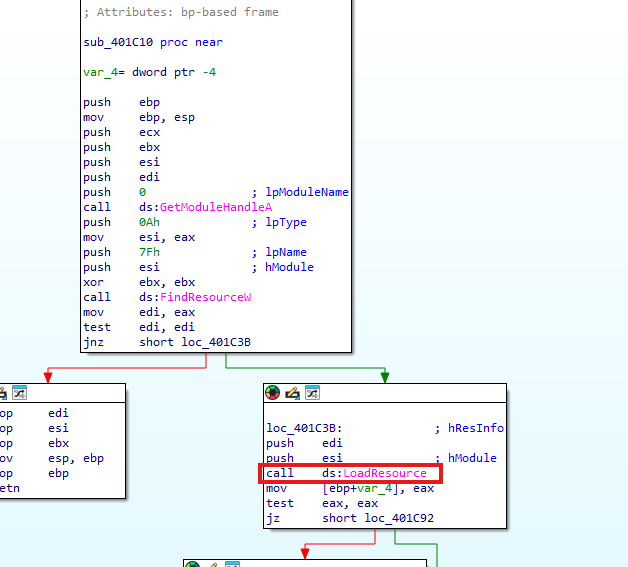
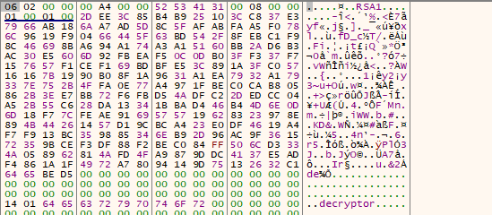
in Big-Endian it's  
-----BEGIN PUBLIC KEY-----
MIIBIjANBgkqhkiG9w0BAQEFAAOCAQ8AMIIBCgKCAQEA1b5lZMEyJhN1nRSUgKdy
SR8ahvSt5TdB3J2HqU/9SoFiiQVKM9NsUP+EwL7yiN/zzps1chU2n6yWLbluNIWY
NbwT+fekGUbf4COkvJzRVxQmREuJjpcjg2IZV1dpka7+fPcYbQ1uTbRG1LobNBPa
KMZVK6UEzO0twt9K1fv2crvnPiuGBbjKwL4fl6R3DvpPK3V+M3mhMnnqoTGWGo+w
kBl7FhZXwD8aiTzlv71p8c7xV3YV9zfzP7ANDPXq+5JtYOUwrLPWKrtgUaGjdKGU
potpRoz5weuPL1S9Y19EZgT5GZZsePCl+quvX4xdradqGKtmeeM3yDwQJbm0hTzu
LQIDAQAB
-----END PUBLIC KEY---  
After this subroutine the malware gets the default language and compare it to the following languages  
|Hex Code|Decimal|Language|Locale Name|
|--------|-------|--------|-----------|
|43Fh    |1087   |Kazakh  |kk-KZ      |
|419h    |1049   |Russian |ru-RU      |
|423h    |1059   |Belarusian| be-BY   |
|422h    |1058   |Ukrainian |uk-UA    |
|444h    |1092   |Tatar     |tt-RU    |
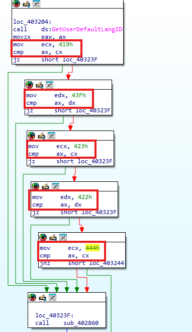
if any of these languages it enters sub_402860 which deletes the malware and exits the process
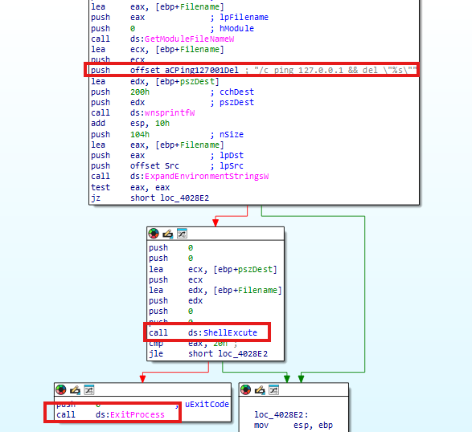
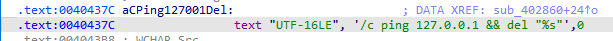
If not it enters sub_402E60
## sub_402E60
It is the core of the malware first thing in this subroutine that it calls another function sub_4028F0 
### sub_4028F0
in this function first it checks for the process privilage 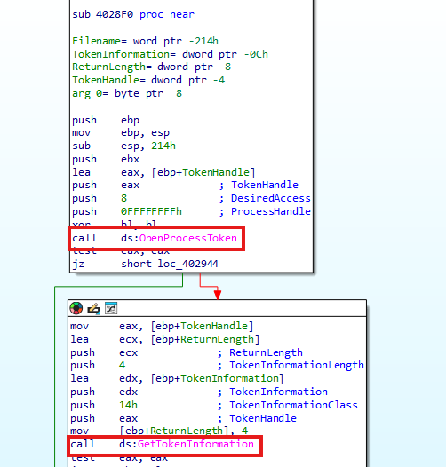  
if it has no administration privilage it run it asks to run itself as administration 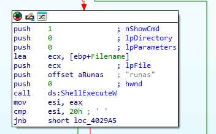  

after sub_4028F0 we go back to sub_402E60 it's intializing RSA using **CryptAcquireContextW**, then the function calls 
sub_401780 to generate public and private key for RSA 1024-bit.  
So the malware uses RSA 1024-bit to encrypt files and then it encrypts the private key with the hardcoded RSA 2048-bit.  
We can get the private key of the RSA 1024-bit but it's unique for every host so if we got the key we can decrypt only one host.  
To decrypt all hosts we should get the private key of RSA 2048-bit and it's only with the author not in the binary.  

Next the malware disable windows defender real-time scanning and core services by editing registry **"SOFTWARE\Policies\Microsoft\Windows Defender"** and set it to **"DisableAntiSpyware"**
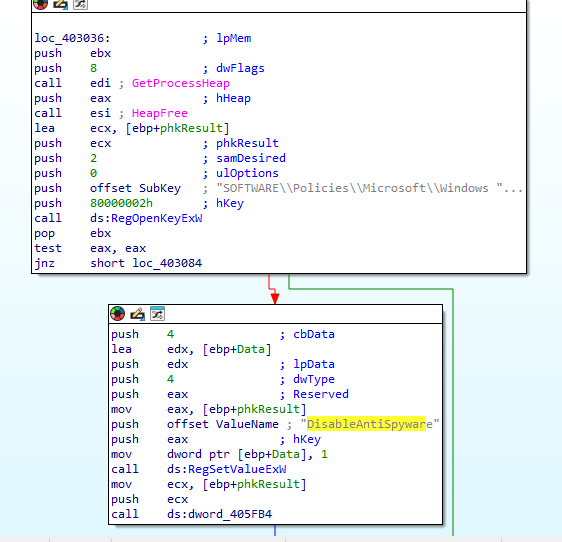

Then the malware deletes any snapshot or shadow copy the host has by excuting this **"\\sysnative\\vssadmin.exe delete shadows /all /quiet"**
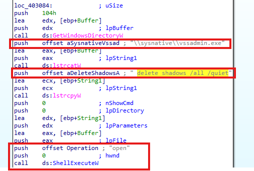

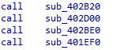
After that we have 4 major subroutine
* **1-** The first one is to get the path to the startup folder and store it **C:\Users\User\AppData\Roaming\Microsoft\Windows\Start Menu\Programs\Startup\\**
* **2-** The secound one is to store the message on the .txt file we talked about earlier and to make your id for contact operator
* **3-** The third is to copy the malware into the startup folder and rename it to a random name
* **4-** The fourth one is to terminate every process and encrypts the files and put the .txt file in each folder,This is where the malware finally exits and delete itself after finshing the encryption.  

# IoCs
|Type    |Indicator|Description|
|--------|---------|-----------|
|Hash MD5|9ac8c2482e25dab49befb711172924f7|Original File Hash|
|File path|C:\Users\User\AppData\Roaming\Microsoft\Windows\Start Menu\Programs\Startup\\ |Drop a copy of itself in the startup folder under a random name|
|Registry|SOFTWARE\Policies\Microsoft\Windows Defender|Disable Windows defender|
|File dropped|---==%$$$OPEN_ME_UP$$$==---.txt|Drops this file after encryption as instructions for contacting the author|